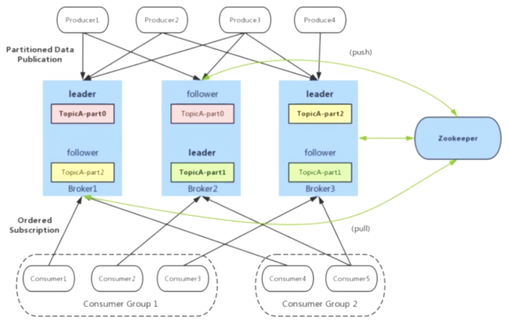

# Kafka

[官方Ver1.0中文文档](http://kafka.apachecn.org/)  
[官方最新文档](https://kafka.apache.org/)  
[awesome-kafka](https://github.com/search?o=desc&q=awesome-kafka&s=stars&type=Repositories)

Kafka具有高吞吐量、内置分区、支持消息副本和高容错的特性。  
像其他消息队列一样，可用于流量削峰、异步、解耦合，以及用于日志聚合、事件监听（发布/订阅）。  
但是Kafka不仅限于作为消息中间件，现在多用于大数据领域作为流处理平台。

最近看的ELK作日志监控的时候经常拿Kafka作为log broker（作为日志收集的中间容器）。

预备知识：

+ **磁盘顺序IO和随机IO**

+ **DMA**

+ **JMS协议**

基本概念：

+ **Broker**

  Kafka集群中的代理节点。可以理解为Kafka服务的门户，消息生产者和消费者都是通过它通信的。Broker节点都会注册到ZK中。

+ **多分区**

  分区指一个有序不变的存储消息的队列，一个Topic下可以有多个分区。  
  分区的消息数据会写入到`log.dir`指定的目录下topic名对应文件夹下的`*.log`二进制文件中，目录下还有个`*.index`是偏移索引、还有`*.timeindex`是时间索引；所以支持通过偏移量和时间进行定位写入。  
  对应的消费者也有记录自己消费了哪些消息、当前消费所在的偏移索引、时间索引，在`__consumer_offsets-*`（*的值=groupid+topic+partitionid ?）目录下。  
  可以手动提交消费信息，也可以通过`enable.auto.commit`，`auto.commit.interval.ms`指定每隔一段时间自动提交一次消费信息。

  消息分区策略：轮询、Hash取模，也可以自行实现更适合业务场景的策略。

  TODO：分区和消费者是一对一、一对多、多对一还是多对多？为何要设计分区？

+ **消息位移(offset)/消费者位移**

  消息位移（即消息在队列里面的位置索引，即上面的*.index中的数据）的操作类似Netty里面Buffer的偏移量。  
  消费者位移，记录消费者消费到了队列中的哪个位置；每个消费者都有自己的消费者位移（万一Broker服务挂了，消息被消费了但是没有更新消费偏移量，就可能导致重复消费）。

  TODO：如何避免重复消费？或如何即使重复消费也能保证结果的幂等性？

+ **消费者组**

  每个Consumer有唯一一个ConsumerGroup；一个分区可以被多个ConsumerGroup消费，但是每个消费这个消息的ConsumerGroup中只能通过一个Consumer消费这个消息。

  Kafka虽然没有RabbitMQ的广播功能，但是却可以通过指定消费者为不同的分组实现广播（多播）的功能。

  TODO：
  1）为什么要分组？
  2）消息消费有超时时间么？没有被消费的消息怎么处理的？
    消息在队列中不会消失么？ --from-beginning 从头消费。

+ **分区副本**

  副本存放在不同的Broker节点；副本数最多为Broker节点数；副本分为Leader和Follower。Leader副本提供读写的功能，而Follower就只是副本不和外界打交道。Follower副本需要主动从Leader副本拉取数据进行同步。当因为网络等原因，Follower副本和Leader数据不一致的时间超过临界值则副本会变成无效的副本（under replication partition，即下线的副本），对应的活跃副本被称为Isr。

+ **批量操作**

  Producer将发送到同一个分区的消息积攒到一定量或超过一定时间后，一起发给Broker。
  参考`batch.size`和`linger.ms`配置项。

## 集群搭建

### Docker集群

因为Kafka集群需要依赖Zookeeper，所以需要同时搭建Zookeeper集群。

ZK集群的配置比较简单，这里主要说下Kafka集群的配置。

**[Kafka Configuration](https://kafka.apache.org/documentation/#configuration)**

还可以查看源码的`KafkaConfig.scala`。

+ Broker Configs

  + zookeeper.connect

    指定连接的zookeeper节点。

  + advertised.host.name & advertised.port（废弃） / advertised.listeners（推荐）

    指定注册到ZK给客户端连接的Kafka Broker的hostname和port。

  + auto.create.topics.enable（true）

    是否允许自动创建Topic。

  + auto.leader.rebalance.enable（true）

    是否允许Topic分区负载均衡。

  + background.threads（10）

    后台任务处理线程数量。

  + broker.id

    broker的ID，未指定，则自动从1001开始自动分配未使用的id号。

  + compression.type（producer）
  + listeners
  + log.dir（/tmp/kafka-logs）

    log 数据存储位置

  + 

+ Topic Configs
+ Producer Configs
+ Consumer Configs
+ Kafka Connect Configs
+ Kafka Streams Configs
+ AdminClient Configs

**集群配置的坑**：

+ **未知的hostname**

  ```
  Error connecting to node kafka1:9092 (id: 1003 rack: null) (org.apache.kafka.clients.NetworkClient)java.net.UnknownHostException: kafka1
  ```
  原因：advertised.host.name 和 advertised.port 在2.2.0之后已经被废弃；如果存在 advertised.listeners，则上面两个配置不起效；虽没有在docker-compose.yml配置 KAFKA_ADVERTISED_LISTENERS，但是容器内部的 config/server.properties 中确是默认存在的；导致advertised.host.name 和 advertised.port 配置不起效果。
  ```
  KAFKA_LISTENERS: PLAINTEXT://0.0.0.0:9092
  KAFKA_ADVERTISED_LISTENERS: PLAINTEXT://kafka1:9092
  #KAFKA_ADVERTISED_HOST_NAME: kafka1
  #KAFKA_ADVERTISED_PORT: 9092
  ```

+ **LEADER_NOT_AVAILABLE**

  ```
  Error while fetching metadata with correlation id 3 : {topic1=LEADER_NOT_AVAILABLE} (org.apache.kafka.clients.NetworkClient)
  ```
  由上面的通信问题导致的。

**Dockerfile分析**

选用的Docker镜像：[wurstmeister/kafka:2.12-2.4.0](https://hub.docker.com/r/wurstmeister/kafka)[Scala:2.12,Kafka:2.4.0] 
查看[Dockerfile](https://github.com/wurstmeister/kafka-docker/blob/master/Dockerfile)得知：  
> 镜像创建时  
> 1) 拷贝几个sh脚本到/tmp，再到/usr/bin；  
> 2) 下载kafka压缩包，解压到/opt目录下，创建软连接/opt/kafka;  
> 3) 使用APK包管理工具安装glibc；  
> 4) 拷贝overrides目录到/opt/overrides(里面有个脚本删除server.properties中的预置的listeners)。  
>
> 容器启动时（执行start-kafka.sh）  
> 1) 首先/opt/overrides/${KAFKA_VERSION}.sh存在的化则执行，这个版本不存在这个文件；
> 2) 然后从命令行或docker-compose.yml中读取（KAFKA_ZOOKEEPER_CONNECT、KAFKA_PORT[默认9092]）  
> 3) create-topics.sh创建消息Topic  
> 3.1) KAFKA_CREATE_TOPICS环境变量不存在则直接退出；  
> 3.2) 读取START_TIMEOUT[默认600ms]，等待kafka启动完毕；  
> 3.3) 执行 "${KAFKA_HOME}/bin/kafka-topics.sh \
		--create \
		--zookeeper ${KAFKA_ZOOKEEPER_CONNECT} \
		--topic ${topicConfig[0]} \
		--partitions ${topicConfig[1]} \
		--replication-factor ${topicConfig[2]} \
		${config} \
		${KAFKA_0_10_OPTS} &"
>

部署参考`deploy`目录。

Kafka Docker集群启动后
```
9126acbd4a6c        wurstmeister/kafka:2.12-2.4.0      "start-kafka.sh"         20 hours ago        Up 20 hours         0.0.0.0:9093->9093/tcp                                 kafka2
7ceb094f6eb9        wurstmeister/kafka:2.12-2.4.0      "start-kafka.sh"         20 hours ago        Up 20 hours         0.0.0.0:9092->9092/tcp                                 kafka1
2a4dda881c9e        wurstmeister/kafka:2.12-2.4.0      "start-kafka.sh"         20 hours ago        Up 20 hours         0.0.0.0:9094->9094/tcp                                 kafka3
784752f3a414        zookeeper:3.4                      "/docker-entrypoint.…"   21 hours ago        Up 21 hours         2888/tcp, 3888/tcp, 0.0.0.0:2185->2181/tcp             zoo2
22b7a5f034cb        zookeeper:3.4                      "/docker-entrypoint.…"   21 hours ago        Up 21 hours         2888/tcp, 3888/tcp, 0.0.0.0:2186->2181/tcp             zoo3
4d30f0262ec6        zookeeper:3.4                      "/docker-entrypoint.…"   21 hours ago        Up 21 hours         2888/tcp, 3888/tcp, 0.0.0.0:2184->2181/tcp             zoo1
```
查看连接状态
```bash
bin/zkCli.sh -server 0.0.0.0:2184
ls /
#[cluster, controller_epoch, controller, brokers, zookeeper, admin, isr_change_notification, consumers, log_dir_event_notification, latest_producer_id_block, config]
#可以看到Kafka的服务已经注册到Zookeeper,除了zookeeper其他的都是kafka注册进去的东西，如 brokers、consumers、config
# ls /brokers/ids => [1003, 1002, 1001]

```

TODO: Kafka都有哪些东西注册到了Zookeeper？`ls /`下面都是什么东西？

## [操作](https://kafka.apache.org/documentation/#operations)与[API](https://kafka.apache.org/documentation/#api)

### [基本操作](https://kafka.apache.org/documentation/#basic_ops)

Kafka提供了一些操作工具在`bin/`目录下。不带参数执行会打印详细的使用说明。

+ 增删改查Topics
  ```bash
  # --bootstrap-server <String: Broker host> 指定直连的Broker, 2.2.0版本前是用 --zookeeper <String: hosts> 通过ZK查询Broker，现已经被废弃
  # TODO：使用这种方式会报 "java.net.UnknownHostException: kafka1: nodename nor servname provided, or not known"
  #   明明指定的是localhost:9092为何连接的是kafka1:9092 ?
  #   临时解决方法是在宿主机/etc/hosts中指定 0.0.0.0 kafka1
  bin/kafka-topics.sh --bootstrap-server localhost:9092 --create --topic topic01 --partitions 3 --replication-factor 2
  # 2.2.0版本之前
  bin/kafka-topics.sh --zookeeper localhost:2184 --create --topic topic01 --partitions 3 --replication-factor 2

  # 查看创建的Topics列表
  bin/kafka-topics.sh --list --zookeeper localhost:2184
  #查看Topic状态
  bin/kafka-topics.sh --describe --zookeeper localhost:2184 --topic topic01

  # 修改Topic
  bin/kafka-topics.sh --zookeeper localhost:2184 --alter --topic topic01 --partitions 2 --replication-factor 3
  ```

+ 命令行发送消息

  ```
  bin/kafka-console-producer.sh --broker-list localhost:9092 --topic topic01
  ```
+ 

### 业务场景使用

+ 如何实现消息的顺序消费？

  将Topic的分区设置为1。


## 架构与实现原理




### Producer -> Broker

#### Producer发送消息到Broker的原理

依赖包: kafka-clients


### Broker集群协调

#### Brokers选举Controller

Kafka控制器，其实就是一个Kafka的Broker。它除了具有一般Broker的功能之外，还具有选举主题分区Leader副本的功能。在启动Kafka系统时，其中一个Broker会被选举为控制器，负责管理主题分区和副本状态，还会执行分区重新分配的管理任务。

++Controller的身份纯粹是Broker先到先得++：每一个Broker启动时都会去Zookeeper系统里面尝试创建一个临时节点/controller，并写入该节点的注册信息，使该节点成为控制器；但是只有第一个Broker会创建成功。

而其他Broker节点会往Controller注册监听器用于报告自己的状态。

#### 主题分区Leader副本选举 


#### Follower分区从Leader同步消息(LEO与HW)


### Broker -> Consumer

消费者（ Consumer ）订阅 Kafka 中的主题（ Topic ），并且从订阅的主题上拉取消息。每一个分区只能被一个消费组中的一个消费者所消费；但是可以被不同消费组消费。


KafkaConsumer 是非线程安全的， KafkaConsumer 中定义了 一个 acquire（）方法，用来检测当前是否只有一个线程在操作，若有其他线程正在操作则会抛出 ConcurrentModifcationException 异常。

#### 消费者消费消息时分区分配的策略：

+ **RangeAssignor**

  RangeAssignor 分配策略的原理是按照消费者总数和分区总数进行整除运算
  来获得一个跨 度，然后将分区按照跨度进行平均分配， 以保证分区尽可能均匀地分配给所有的消
费者 。

+ **RoundRobinAssignor**
  
  RoundRobinAssignor 分配策略的原理是将消费组内所有消费者及消费
者订阅的所有主题的分区按照字典序排序，然后通过轮询方式逐个将分区依次分配给每个消费者。

+ **StickyAssignor**

  Kafka从 0.11.x 版本开始引入这种分配策略，它主要有两个目的 ：
  1）分区的分配要尽可能均匀 。
  2）分区的分配尽可能与上次分配的保持相同。

#### 消费者消费消息并提交消费位移

#### Rebalance机制

rebalance是指分区的所属权从一个消费者转移到另一消费者的行为，它为消费组具备高可用性和伸缩性提供保障。 rebalance发生期间，消费组内的消费者是无法读取消息的。 
当一个分区被重新分配给另一个消费 者时，消费者当前的状态也会丢失。

触发消费者rebalance的场景：
+ consumer所在服务重启或宕机了
+ 动态给topic增加了分区
+ 消费组订阅了更多的topic

#### 消费者协调器和组协调器


### 日志存储

+ Kafka实现高吞吐率的原因

  因为Kafka可以批量地直接顺序读写数据从/到硬盘，并对数据进行压缩存储。

  TODO：那么多数据，怎么就确保每次想要的数据就正好存在磁盘上相连的空间上？


