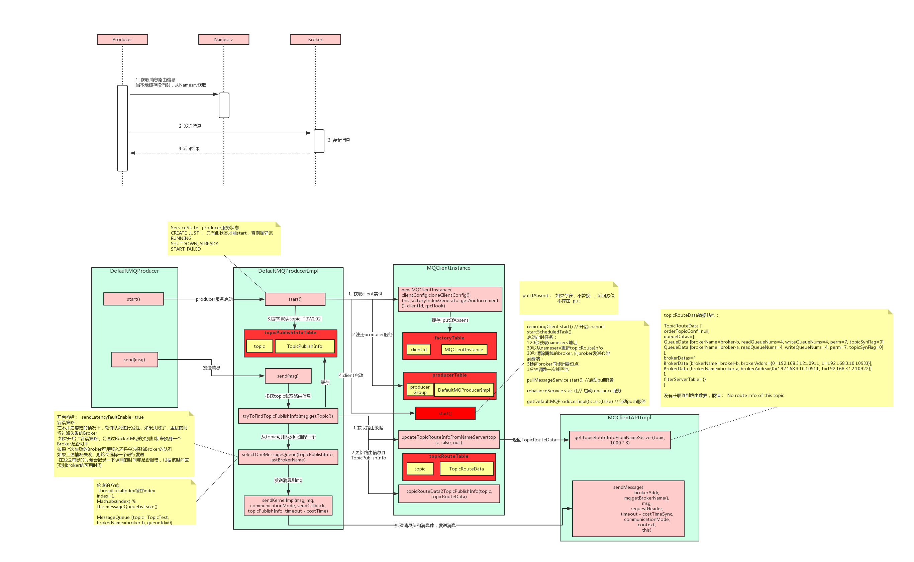
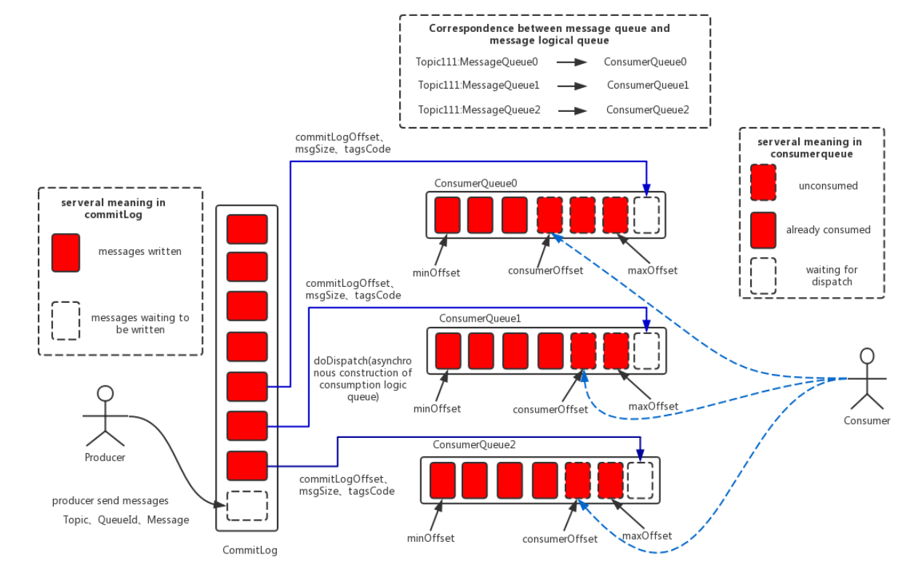
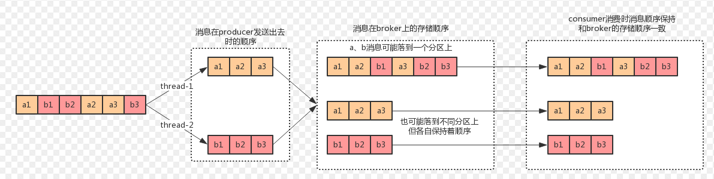

# RocketMQ

## RocketMQ架构

Producer、NamesrvCluster、BrokerCluster、Cousumer。


+ **Producer Group**

+ **Consumer Group**

  一个 Consumer Group 下包含多个 Consumer 实例,可以是多台机器,也可以是多个进程,或者是一个进程的多个 Consumer 对象。一个 Consumer Group 下的多个 Consumer 以均摊方式消费消息,如果设置为广播方式,那么这个 Consumer Group 下的每个实例都消费全量数据。

+ **Name Server**  
  专为 RocketMQ 设计的轻量级名称服务,代码小亍 1000 行,具有简单、可集群横吐扩展、无状态等特点。将要支持的主备自劢切换功能会强依赖 Name Server。

+ **Topic和Broker、Queue、消费者的关系**

  一个Topic的多个消息可能在不同的Broker中不同的Queue上存储。  
  一个消费者只能消费一种Topic。  
  一个队列只能由一个消费者消费。  
  同一个组的消费者不能同时监听不同Topic消息(不然容易出现某些队列无法被消费的情况)。  
  

+ **Broker主从的作用**

  多Broker主节点是为了数据分片存储与高可用；  
  Broker主从节点提升消息可靠性（防止机器故障、磁盘损坏），个人认为Broker主从应该称为主备，因为ＭＱ消息读取后就不应该再存在于队列中了，
  如果要做主从读写分离，读完之后需要同步更新其他所有队列，和关系型数据库读写分离不同，这里没有意义。

+ **消费者队列**

  消费者队列中存储的并不是消息本身，而是消费偏移量，消息大小，tag hashcode; 消息本身真正存储在　CommitLog日志文件中; 

  为了方便从CommitLog日志文件检索消息，RocketMQ还建立了一个IndexFile(索引文件)。使用IndexFile可以快速索引到消息本身。

## 消息发送、存储与消费流程

### 消息结构

+ Producer端

  Topic + Body + Tags + Keys + Flag + DelayTimeLevel + WaitStoreMsgOK 

+ Consumer端

  由于 Broker 会为 Message增加数据结构,所以消息到达 Consumer 后,会在 Message 基础上增加多个字段, Consumer 看到的是
MessageExt 这个数据结构,MessageExt 继承于 Message。

### 消息发送、存储与节点同步

Producer启动与消息发送流程：


消息发送应该存储到topic哪个队列，RocketMQ提供了３种算法：  
1）随机算法(随机生成一个队列size以内的数)  
2）Hash取模算法（对arg求hash取队列size的模，即可以通过arg控制将数据写入哪个队列）  
3）就近机房算法（需要自行实现）

消息存储流程：


### 消息消费

#### 消费详细流程

1）新建`DefaultMQPushConsumer`对象，设置订阅的Topic及Tags和消费位移模式；  
2）注册消息监听器，有两种监听器接口`MessageListenerOrderly`和`MessageListenerConcurrently`;  
3）这个只是设置一下`DefaultMQPushConsumerImpl`的`messageListenerInner`成员变量，真正的注册在`DefaultMQPushConsumer$start()`方法中。
通过调用`MQClientInstance$registerConsumer()`方法将监听器注册到 `consumerTable (ConcurrentMap<String, MQConsumerInner>)`，典型的观察者模式。  
```
public boolean registerConsumer(String group, MQConsumerInner consumer) {
        if (null != group && null != consumer) {
            MQConsumerInner prev = (MQConsumerInner)this.consumerTable.putIfAbsent(group, consumer);
            ...
        } else {
            return false;
        }
    }
```
4）启动监听线程,`RebalanceService$run()`,一直阻塞等待＋轮询等待消息。  
```
public void run() {
    this.log.info(this.getServiceName() + " service started");
    while(!this.isStopped()) {
        this.waitForRunning(waitInterval);
        //参考第５）步分析
        this.mqClientFactory.doRebalance();
    }
    this.log.info(this.getServiceName() + " service end");
}
```
5）当有消息到来，执行doRebalance()方法；  
第一步做Round-Robin选择消费者组中的一个消费者（API `MQConsumerInner`）进行处理消息；有两种实现`DefaultMQPullConsumerImpl`、`DefaultMQPushConsumerImpl`。  
5.1) DefaultMQPushConsumerImpl消费消息
```java
DefaultMQPushConsumerImpl$rebalanceImpl.doRebalance(this.isConsumeOrderly());
  RebalanceImpl$rebalanceByTopic(topic, isOrder);
    //有两种消费模式模式
    //1 广播消费

    //2 集群消费

```

#### pull 和 push

push方式里，consumer把轮询过程封装了，并注册MessageListener监听器，取到消息后，唤醒MessageListener的consumeMessage()来消费，对用户而言，感觉消息是被推送过来的。

pull方式里，取消息的过程需要用户自己写，首先通过打算消费的Topic拿到MessageQueue的集合，遍历MessageQueue集合，然后针对每个MessageQueue批量取消息，一次取完后，记录该队列下一次要取的开始offset，直到取完了，再换另一个MessageQueue。

#### 集群消费和广播消费

广播消费：一条消息被多个 Consumer 消费,即使这些 Consumer 属于同一个 Consumer Group,消息也会被 Consumer Group 中的每个 Consumer 都消费一次。

集群消费的算法（每个队列只能由一个消费者消费）：  
1）平均分配算法  
2）环形平均分配算法  
这些算法是将队列平均分给消费者，如果消费者数量多于队列数量，则必然有消费者处理空闲状态。


### 事务消息

通过RocketMQ消息队列实现分布式事务,4.3.0版本之后已经提供了默认支持；基于XA两阶段提交模型。

比如下单场景，扣款在AccountService,加积分在MemberService中；
要确保扣款和加积分同时成功或失败。

对应伪代码
```
transaction {
  扣款();
  boolean success = 发送MQ();
  if(success) {
    commit();
  } else {
    rollback();
  }
}
```
#### 工作原理


１）扣款服务发送消息（消息内容是为某用户加多少积分）；  
２）MQ服务器接收到消息存储下来，返回一个确认消息，告诉扣款服务消息发送成功；  
３）扣款服务接收到确认消息后执行扣款本地事务；   
４）扣款成功则再向MQ服务器发送commit请求消息；失败则发送rollback请求消息；ＭＱ服务器接收到commit或rollback,分别执行设置之前保存的消息对MQ订阅方可见或丢弃之前保存的消息；  
５）如果一段时间MQ没有接收到第４步的事务状态（commit/rollback）,则向MQ发送方发送请求（？怎么实现）要求发送方回查事务状态；  
６）扣款服务查询本地事务状态;  
７）根据事务的状态发送commit/rollback请求消息；ＭＱ服务器接收到commit或rollback,分别执行设置之前保存的消息对MQ订阅方可见或丢弃之前保存的消息；  

经过前面７步，分布式事务失败可能性已经很小了;  
但还是可能有问题：可能扣款成功但是加积分失败,可能由于是MQ订阅方消费消息失败进入死信队列或者更新数据库的时候失败要记录失败日志；由人工干预（不可能做到万物一失，就像https安全一样）。

#### 代码实现

```java
TransactionMQProducer$sendMessageInTransaction(Message, Object)
  DefaultMQProducerImpl$sendMessageInTransaction(Message, TansactionListener, Object)
    //标识事务消息
    MessageAccessor.putProperty(msg, "TRAN_MSG", "true");
    MessageAccessor.putProperty(msg, "PGROUP", this.defaultMQProducer.getProducerGroup());
    //执行上图中第１步，发送“加积分”的消息
    sendResult = this.send(msg);
      //SEND_OK（第２步返回），发送成功则执行本地事务(第３步),执行后返回事务消息状态，
      //事务消息的三个半状态：UNKNOW COMMIT_MESSAGE ROLLBACK_MESSAGE
      localTransactionState = tranExecuter.executeLocalTransaction(msg, arg);
      //FLUSH_DISK_TIMEOUT、FLUSH_SLAVE_TIMEOUT、SLAVE_NOT_AVAILABLE（第２步返回），异常直接设置ROLLBACK_MESSAGE
      localTransactionState = LocalTransactionState.ROLLBACK_MESSAGE;
    //结束事务：针对前面返回的事务消息状态，提交消息COMMIT/ROLLBACK（第４步）
    this.endTransaction(sendResult, localTransactionState, localException);

//Broker中TransactionMessageCheckService则每隔一定时间（默认１分钟），检查之前提交的消息（加积分）对应的本地事务（扣款）执行状态
TransactionMessageCheckService$run()
  this.waitForRunning(checkInterval)
    this.onWaitEnd();
      //读取配置的事务超时时间
      long timeout = brokerController.getBrokerConfig().getTransactionTimeOut();
      //读取最大的校验次数
      int checkMax = brokerController.getBrokerConfig().getTransactionCheckMax();
      //事务消息回查的核心方法
      this.brokerController.getTransactionalMessageService().check(timeout, checkMax, this.brokerController.getTransactionalMessageCheckListener());
        //１ 前面第１步发送的消息(prepare阶段消息)存储在一个半消息队列，RMQ_SYS_TRANS_HALF_TOPIC 对应的队列
        //２ 回查消息对应本地事务状态，会消费RMQ_SYS_TRANS_HALF_TOPIC 中的消息，如果是UNKNOW状态将消息和状态回写到刚才的队列，如果是COMMIT和ROLLBACK状态则将消息存储到RMQ_SYS_TRANS_OP_HALF_TOPIC对应的队列（COMMIT状态还会将消息发给消费者能够读取的队列）。
```

事务消息源码解析可参考：  
[RocketMQ源码分析之RocketMQ事务消息实现原理](https://blog.csdn.net/prestigeding/article/details/81263833)

相关接口和类

+ TransactionListener
  
  事务监听器

+ TransactionMessageCheckService

  事务消息回查服务

+ DefaultMQProducerImpl

  producer实现类，封装了事务消息发送和事务状态检查

+ TransactionMessageBridge 

  处理half message (对应prepare message)

### 消息使用规范

1） 一个应用尽可能用一个 Topic,消息子类型用 tags 来标识,tags 可以由应用自由设置。只有发送消息设置了
tags,消费方在订阅消息时,才可以利用 tags 在 broker 做消息过滤。

2） 每个消息在业务局面的唯一标识码,要设置到 keys 字段,方便将来定位消息丢失问题。服务器会为每个消息创建索引(哈希索引)
,应用可以通过 topic,key 来查询返条消息内容,以及消息被谁消费。由于是哈希索引,请务必保证 key 尽可能唯一,返样可以避免潜在的哈希冲突。

3） 消息収送成功戒者失败,要打印消息日志,务必要打印 sendresult 和 key 字段。

4） 消息发送成功后，需要根据返回的确认信息做后置处理。
  ```
  SEND_OK
  消息収送成功
  FLUSH_DISK_TIMEOUT
  消息収送成功,但是服务器刷盘超时,消息已经进入服务器队列,只有此时服务器宕机,消息才会丢失
  FLUSH_SLAVE_TIMEOUT
  消息収送成功,但是服务器同步到 Slave 时超时,消息已经进入服务器队列,只有此时服务器宕机,消息才会丢失
  SLAVE_NOT_AVAILABLE
  消息发送成功,但是此时 slave 不可用,消息已经进入服务器队列,只有此时服务器宕机,消息才会丢失
  ```

5）对亍消息不可丢失应用,务必要有消息重发机制,例如如果消息发送失败,存储到数据库,能有定时程序尝试重发,或者人工触发重发。

### 消息刷盘

分为同步刷盘、异步刷盘


### 顺序消息

将具有先后顺序的消息放在同一个队列

### 消息过滤

实现原理：  
1）Broker 所在的机器会启动多个 FilterServer 过滤进程;  
2）Consumer 启动后,会向 FilterServer 上传一个过滤的 Java 类（里面定义过滤规则）  
3）Consumer 从 FilterServer 拉消息FilterServer 将请求转发给 Broker,FilterServer 从 Broker 收到消息后,按照
Consumer 上传的 Java 过滤程序做过滤,过滤完成后返回给 Consumer。

### 死信队列

消息消费重试，当重试次数达到默认的16次后（可以通过配置文件修改）如果对应的消息还没被成功消费的话，该消息就会投递到DLQ死信队列。

％DLQ%your_topic

perm权限：２（用户只可读）

## 特点

### 零拷贝

## 工作常用功能

### 顺序消息

使用`MessageQueueSelector`定义消息入队时对队列的选择。   
说白了就是控制将同一个事务的多个操作按顺序进入到同一个队列，
同时消费的时候也用同一个线程读取事务的多个操作的消息。



### 消息去重/解决重复消费

方法１：

Consumer每次读取消息后，做后续处理前先去Redis、MySQL中查询此消息的
msgID是否存在，不存在则将msgID存储到Redis、MySQL中，然后执行后至处理。但是要注意做并发同步防止多个消费者在极限时间差下并发问题，根据消费者是否在同一个应用分别选择使用JVM级锁和分布式锁。

方法２:

使用业务层面的状态机去重

### 保证消息100%不丢失

使用同步发送模式等待同步消息落盘到Disk之后再发送消息发送成功确认信息。

但是还有可能上面步骤都正常最后发送确认信息时网络失败生产者接收不到确认信息。这种情况下生产者需要做超时重试，重试失败后还要做存储消息到本地消息表。

### 消息堆积解决

具体操作步骤和思路如下:  
１）先修复 consumer 的问题,确保其恢复消费速度,然后将现有 consumer 都停掉。  
２）新建一个 topic,partition 是原来的 10 倍,临时建立好原先 10 倍的 queue 数量。  
３）接着临时征用 10 倍的机器来部署 consumer,每一批 consumer 消费一个临时 queue 的数据。这种做法相当于是临时将 queue 资源和 consumer 资源扩大 10 倍,以正常的 10 倍速度来消费数据。  
４）等快速消费完积压数据之后,得恢复原先部署的架构,重新用原先的 consumer 机器来消费消息。  

### 实现延时处理

比如订单未支付，30分钟有效，超时取消订单。  

使用RocketMQ延时消息，即`Message$setDelayTimeLevel()`方法; 

RocketMQ延时消息发送后并不是直接发到创建订单的队列而是先发到一个延时队列，等待一段时间后才会将消息重延时队列发到创建订单的队列; 可以在到期时间到来后拦截消息做下用户是否付费检查，已经付费的话再将订单发给生成订单的队列。

## 其他常见问题

+ **消息发布订阅**

  producer.send() 与　consumer.subscribe()

+ **消息发送失败**

  启用Producer send 内部重试功能。   
  1. 至多重试 3 次。
  2. 如果収送失败,则轮转到下一个 Broker。
  3. 返个方法的总耗时时间丌超过 sendMsgTimeout 设置的值,默讣 10s。

+ **如何提高消费效率**

  1. 同一个 ConsumerGroup 下,通过增加 Consumer 实例数量来提高并行度,超过订阅队列数的 Consumer 实例无效。
      可以通过加机器,戒者在已有机器启劢多个迕程的方式。
  2. 提高单个 Consumer 的消费幵行线程,通过修改以下参数
      consumeThreadMin
      consumeThreadMax
  3. 跳过非重要消息
  4. 优化消费者性能
  
+ **消费幂等**

## 附录

### Open Messaging

感觉相当于开发一个适配层，可以适配各种不同的消息中间件。
就像log4j和各种日志实现差不多。