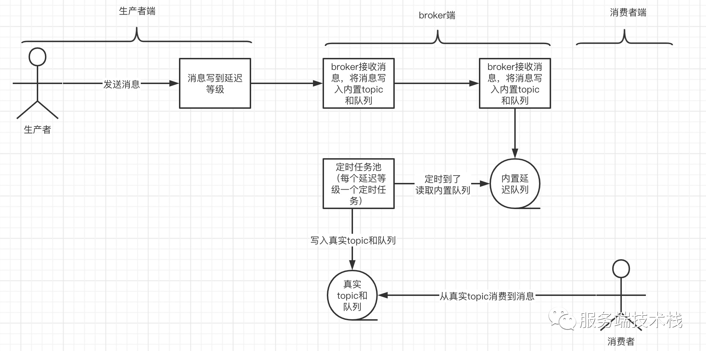

# 关键概念

## RocketMQ关键概念

+ **消息类型**：包括普通消息、顺序消息、事务消息和定时/延时消息。

  **顺序消息**实现原理：通过定制`MessageQueueSelector`将需要保持相对顺序的几个消息加入同一个队列；同时需要在Cosumer中使用MessageListenerOrderly对象保证处理完一个后再从队列取下一个处理，MessageListenerOrderly在RocketMQ内部就会通过锁队列的方式保证消息是一个一个队列来取的。

  > 消息加入同一个队列，只能保证取消息是按顺序取，但是RocketMQ处理消息是将取出的消息交给线程池处理，即多个有顺序的消息即使按顺序加入了同一个队列也还是无法确保是按顺序消费的，所以还需要借助MessageListenerOrderly或者自行实现消费监听器，以确保顺序消费。

  **延迟消息**实现原理：（借张图说明）延迟消息并不是直接写入到主题对应的队列中，而是先写入到内置的延迟队列（topic：SCHEDULE_TOPIC_XXXX）中，由定时任务检查是否到时间，到时间了再将消息写如到主题对应的队列中。

  比如处理超时订单。

  

  消息的数据结构：

  ```java
  //org.apache.rocketmq.common.message.Message
  private String topic;
  private int flag;
  private Map<String, String> properties;	//存储消息的标签TAGS等信息
  private byte[] body;
  private String transactionId;
  
  //org.apache.rocketmq.common.message.MessageExt
  private int queueId;
  private int storeSize;
  private long queueOffset;
  private int sysFlag;
  private long bornTimestamp;
  private SocketAddress bornHost;
  private long storeTimestamp;
  private SocketAddress storeHost;
  private String msgId;
  private long commitLogOffset;
  private int bodyCRC;
  private int reconsumeTimes;
  private long preparedTransactionOffset;	
  ```

+ **批量消息**

  官方建议一个批次消息的大小不要超过1MB。

+ **主题与队列关系**

  所有主题都是由多个队列组成，以此实现队列数量的水平拆分和队列内部的流式存储。队列通过QueueId来做唯一标识和区分。

+ **生产者组**

  生产者中，会把同一类Producer组成一个集合，叫做生产者组。同一组的Producer被认为是**发送同一类消息且发送逻辑一致**。

+ **消费者组**

  消费者同样会把同一类Consumer组成一个集合，叫做消费者组，这类Consumer通常**消费同一类消息且消费逻辑一致**。

  > 为方便理解放两张图：
  >
  > 
  >
  > 

+ **发送方式**

  RocketMQ提供多种发送方式，同步发送、异步发送、顺序发送、单向发送。同步和异步方式均需要Broker返回确认信息，单向发送不需要。

+ **消费形式**

  拉取式消费Pull、推动式消费Push。

  拉取式消费的应用通常主动调用Consumer的拉消息方法从Broker服务器拉消息、主动权由应用控制。一旦获取了批量消息，应用就会启动消费过程。
  推动式消费模式下Broker收到数据后会主动推送给消费端，该消费模式一般实时性较高。

+ **消费模式**

  集群消费（Clustering）和广播消费（Broadcasting）。

  集群消费模式下, 相同Consumer Group的每个Consumer实例平均分摊消息。

  广播消费模式下，相同Consumer Group的每个Consumer实例都接收全量的消息。

+ **消息持久化**

  存储文件主要分为三个部分：
  **CommitLog**：存储消息的元数据。所有消息都会顺序存入到CommitLog文件当中。CommitLog由多个文件组成，每个文件固定大小1G。以第一条消息的偏移量为文件名。

  **ConsumerQueue**：存储消息在CommitLog的索引。一个MessageQueue一个文件，记录当前MessageQueue被哪些消费者组消费到了哪一条CommitLog。

  **IndexFile**：为了消息查询提供了一种通过key或时间区间来查询消息的方法，这种通过IndexFile来查找消息的方法不影响发送与消费消息的主流程。

  另外，还有几个辅助的存储文件：

  checkpoint：数据存盘检查点。里面主要记录commitlog文件、ConsumeQueue文件以及IndexFile文件最后一次刷盘的时间戳。

  config/*.json：这些文件是将RocketMQ的一些关键配置信息进行存盘保存。例如Topic配置、消费者组配置、消费者组消息偏移量Offset 等等一些信息。
  abort：这个文件是RocketMQ用来判断程序是否正常关闭的一个标识文件。正常情况下，会在启动时创建，而关闭服务时删除。但是如果遇到一些服务器宕机，或者kill -9这样一些非正常关闭服务的情况，这个abort文件就不会删除，因此RocketMQ就可以判断上一次服务是非正常关闭的，后续就会做一些数据恢复的操作。

+ **消费过滤**

  将符合条件的消息投递给消费者。RocketMQ 支持Tag标签过滤和SQL属性过滤。

  + **Tag标签过滤** （简单规则）

    通过生产消息时预先为消息设置的一些标签属性（属性名：TAGS）进行匹配；

    过滤规则：单Tag匹配、多个Tag匹配（如：Tag1||Tag2||Tag3）、全部匹配（*）。

  + **SQL属性过滤**（可实现复杂规则）

    使用SQL92语法，对消息的属性值（Map<String, String> properties;）进行匹配。

+ **队列**

  一个主题的消息可能对应多个队列，比如默认创建一个主题会默认指定16个读队列和16个写队列（物理上有16个队列），perm为6可读可写。

  发送一个主题的消息，消息可能存储到这个主题对应的任意一个队列中，具体根据路由规则定。

  > 关于读队列与写队列：
  >
  > 读写队列是**逻辑上的概念**，队列创建的时候会以写为准，你可以尝试着去设置不同的读写队列，看下producer以及consumer的表现。这个功能尤其是在**系统收缩**的时候非常有用，比如说现在有8个队列，我把写队列设置为4，那么其中的4个队列就不再写入，只需要在另外4个队列全部消费成功后下掉即可。
  >
  > 总结：就是标记哪些队列可以继续写，哪些队列还可以读。
  >
  > perm（读写权限）:
  >
  > - 6：读写状态，当前队列允许读取消息和写入消息。
  > - 4：只读状态，当前队列只允许读取消息，不允许写入消息。
  > - 2：只写状态，当前队列只允许写入消息，不允许读取消息。
  > - 0：不可读写状态，当前队列不允许读取消息和写入消息。
  >
  > 参考：https://github.com/apache/rocketmq/issues/1296

  **最小位点**：也称为消费进度的起始位置，代表消费者开始消费的位置。在 RocketMQ 中，最小位点的标记方式为 `EARLIEST` 或 `LATEST`。

  - `EARLIEST` 标记代表消费者会从消息队列的最早的消息开始消费。
  - `LATEST` 标记代表消费者会从消息队列中最新的消息开始消费。

  最小位点的选择取决于消费者的需求，例如在消费历史消息时，应该选择 `EARLIEST`，而在只关心最新消息时，应该选择 `LATEST`。

  **最大位点**：也称为消费进度的结束位置，代表消费者消费的结束位置。在 RocketMQ 中，最大位点的标记方式为消息的 offset。

  最大位点的选择通常是由消费者来控制的，可以将其设置为最近一次消费失败时所消费成功的消息的 offset，然后重新开始消费，也可以将其设置为所需消费的最新消息的 offset。

  **消费位点**：可以查看 dashboard 的“消费者”-“消费详情”。

  BrokerOffset 为生产的条数

  ConsumerOffset 为消费的条数

  DiffTotal 为堆积的条数

  若消费者分组的初始消费位点或当前消费位点不符合您的业务预期，您可以通过重置消费位点调整您的消费进度。

  > 消费进度原理：https://rocketmq.apache.org/zh/docs/featureBehavior/09consumerprogress#%E6%B6%88%E8%B4%B9%E8%BF%9B%E5%BA%A6%E5%8E%9F%E7%90%86

